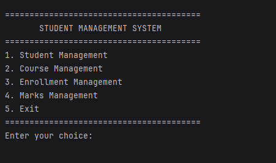
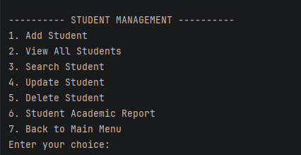
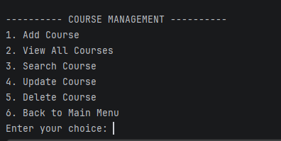
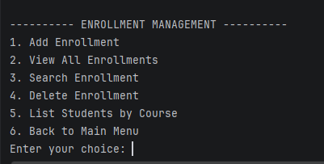
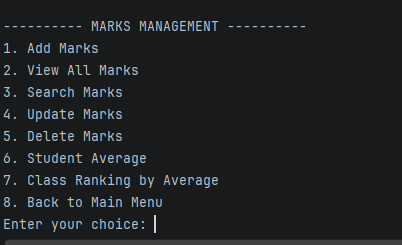
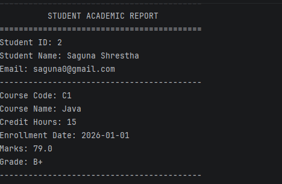
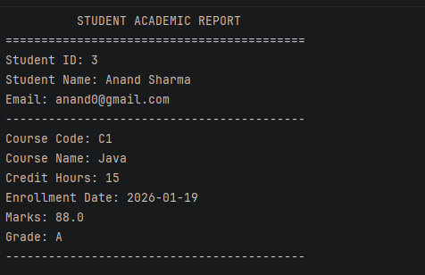
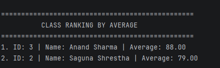

# Student Management System

## 1. Project Overview

The Student Management System is a menu-driven Java console application developed to manage student academic information.

The application uses Java for the main system logic and PostgreSQL as the backend database. JDBC is used to connect the Java application with PostgreSQL.

The system allows users to manage students, courses, enrollments, marks, departments, teachers, attendance, fee records, and student complaints. When a user adds, updates, or deletes information through the application, the changes are stored directly in the PostgreSQL database.

---

## 2. Objectives

The main objectives of this project are:

- To manage student records efficiently.
- To manage course information.
- To enroll students in courses.
- To manage student marks and grades.
- To organize students, courses, and teachers under departments.
- To manage teachers and link them to the courses they teach.
- To track student attendance for each course.
- To maintain student fee and payment records.
- To allow student complaints to be recorded and viewed.
- To calculate student average marks.
- To generate class rankings based on average marks.
- To demonstrate Object-Oriented Programming concepts using Java.
- To demonstrate JDBC connectivity with PostgreSQL.
- To perform database CRUD operations.
- To provide input validation and exception handling.
- To store application data permanently in a relational database.

---

## 3. Main Features

### Student Management

- Add student
- View all students
- Search student by ID
- Search students by name
- Assign a department to a student
- Update student information
- Delete student
- Generate student academic report

### Course Management

- Add course (with department and teacher)
- View all courses (shows department and teacher)
- Search course by ID
- Update course information
- Delete course

### Enrollment Management

- Add student enrollment
- View all enrollments
- Search enrollment
- Delete enrollment
- List students enrolled in a particular course

### Marks Management

- Add marks
- Automatically calculate grade
- View all marks
- Search marks
- Update marks
- Delete marks
- Calculate student average
- Generate class ranking based on average marks

### Department Management

- Add department
- View all departments
- Update department
- Delete department

### Teacher Management

- Add teacher
- View all teachers
- Search teacher by name
- Update teacher
- Delete teacher
- Assign teacher to a course
- View courses taught by a teacher

### Attendance Management

- Mark attendance (Present / Absent / Late) for a student in a course
- View all attendance records
- View attendance of a particular student
- Delete attendance record
- Attendance percentage report for a student in a course

### Fee Management

- Add fee record for a student
- View all fee records
- View fee records of a particular student
- Mark a fee as paid (paid date and payment method)
- Delete fee record

### Complaint Management

- Add student complaint
- View all complaints
- View complaints of a particular student

### Input Validation

The application validates:

- Integer input
- Decimal input
- Empty text input
- Enrollment date format
- Marks between 0 and 100
- Delete confirmation

---

## 4. Technologies Used

| Technology | Purpose |
|---|---|
| Java | Application development |
| PostgreSQL | Backend relational database |
| JDBC | Connecting Java with PostgreSQL |
| IntelliJ IDEA | Development environment |
| Git/GitHub | Version control and project submission |

---

## 5. System Requirements

### Software Requirements

- Java JDK 11 or higher
- PostgreSQL
- PostgreSQL JDBC Driver
- IntelliJ IDEA or another Java IDE
- Git for version control and GitHub submission

### Hardware Requirements

- Computer with at least 4 GB RAM
- Sufficient storage space
- Keyboard and display for console interaction

---

## 6. Project Structure

```text
Student Management System
│
├── database
│   └── schema.sql
│
├── src
│   ├── dao
│   │   ├── AttendanceDAO.java
│   │   ├── ComplaintDAO.java
│   │   ├── CourseDAO.java
│   │   ├── DepartmentDAO.java
│   │   ├── EnrollmentDAO.java
│   │   ├── FeeDAO.java
│   │   ├── MarksDAO.java
│   │   ├── StudentDAO.java
│   │   └── TeacherDAO.java
│   │
│   ├── exception
│   │   └── StudentNotFoundException.java
│   │
│   ├── model
│   │   ├── Attendance.java
│   │   ├── Complaint.java
│   │   ├── Course.java
│   │   ├── Department.java
│   │   ├── Enrollment.java
│   │   ├── Fee.java
│   │   ├── Marks.java
│   │   ├── Person.java
│   │   ├── Student.java
│   │   └── Teacher.java
│   │
│   ├── util
│   │   └── DBConnection.java
│   │
│   └── Main.java
│
├── .gitignore
└── README.md

```

## 7. Database Design

The application uses PostgreSQL as the backend relational database.

The database name used by the project is:

student_management

The database contains four main tables:

- students
- courses
- enrollments
- marks

These tables are used to store student information, course information, student enrollments, and academic marks.

### Students Table

The students table stores basic information about students.

```text
students
---------
id
name
email
phone
address
department_id
```
### Courses Table

The courses table stores basic information about courses.

```text
courses
-------
id
course_code
course_name
credit_hours
department_id
teacher_id
```
### Enrollments Table

The enrollments table stores information about student course enrollments.

```text
enrollments
-----------
id
student_id
course_id
enrollment_date
```
### Marks Table

The marks table stores academic marks and grades of students.
```text
marks
-----
id
student_id
course_id
marks
grade

```
### Departments Table

The departments table stores the departments of the institution.

```text
departments
-----------
id
department_code
department_name
```
### Teachers Table

The teachers table stores teacher information. Each teacher can belong to a department and can be linked to courses through the courses table.

```text
teachers
--------
id
name
email
phone
designation
department_id
```
### Attendance Table

The attendance table stores the daily attendance status (Present, Absent, or Late) of a student in a course.

```text
attendance
----------
id
student_id
course_id
attendance_date
status
```
### Fees Table

The fees table stores fee and payment records of students.

```text
fees
----
id
student_id
amount
due_date
paid_date
status
payment_method
```
### Complaints Table

The complaints table stores complaints submitted by students.

```text
complaints
----------
id
student_id
subject
description
complaint_date
status
```

## 8. Database Schema

The complete SQL database schema is provided in:

database/schema.sql

### Existing Project Database

The student_management database and its required tables have already been created and tested during the development of this project.

The existing database structure is:

```text
student_management
│
├── departments
├── teachers
├── students
├── courses
├── enrollments
├── marks
├── attendance
├── fees
└── complaints

departments
-----------
id              SERIAL PRIMARY KEY
department_code VARCHAR(20) UNIQUE NOT NULL
department_name VARCHAR(100) NOT NULL

teachers
--------
id              SERIAL PRIMARY KEY
name            VARCHAR(100) NOT NULL
email           VARCHAR(100) UNIQUE NOT NULL
phone           VARCHAR(20)
designation     VARCHAR(50)
department_id   INT REFERENCES departments(id) ON DELETE SET NULL

students
---------
id              SERIAL PRIMARY KEY
name            VARCHAR(100) NOT NULL
email           VARCHAR(100) UNIQUE NOT NULL
phone           VARCHAR(20)
address         VARCHAR(200)
department_id   INT REFERENCES departments(id) ON DELETE SET NULL

courses
-------
id              SERIAL PRIMARY KEY
course_code     VARCHAR(20) UNIQUE NOT NULL
course_name     VARCHAR(100) NOT NULL
credit_hours    INT NOT NULL
department_id   INT REFERENCES departments(id) ON DELETE SET NULL
teacher_id      INT REFERENCES teachers(id) ON DELETE SET NULL

enrollments
-----------
id              SERIAL PRIMARY KEY
student_id      INT NOT NULL
course_id       INT NOT NULL
enrollment_date DATE NOT NULL

marks
-----
id              SERIAL PRIMARY KEY
student_id      INT NOT NULL
course_id       INT NOT NULL
marks           DECIMAL(5,2) NOT NULL
grade           VARCHAR(5)

attendance
----------
id              SERIAL PRIMARY KEY
student_id      INT NOT NULL REFERENCES students(id) ON DELETE CASCADE
course_id       INT NOT NULL REFERENCES courses(id) ON DELETE CASCADE
attendance_date DATE NOT NULL
status          VARCHAR(10) NOT NULL   -- Present / Absent / Late
UNIQUE (student_id, course_id, attendance_date)

fees
----
id              SERIAL PRIMARY KEY
student_id      INT NOT NULL REFERENCES students(id) ON DELETE CASCADE
amount          DECIMAL(10,2) NOT NULL
due_date        DATE NOT NULL
paid_date       DATE
status          VARCHAR(10) NOT NULL DEFAULT 'Unpaid'   -- Paid / Unpaid
payment_method  VARCHAR(30)

complaints
----------
id              SERIAL PRIMARY KEY
student_id      INT NOT NULL REFERENCES students(id) ON DELETE CASCADE
subject         VARCHAR(150) NOT NULL
description     VARCHAR(1000) NOT NULL
complaint_date  DATE NOT NULL
status          VARCHAR(15) NOT NULL DEFAULT 'Pending'   -- Pending / Resolved

```

The `schema.sql` file also contains sample data for the departments, teachers, attendance, fees, and complaints tables, and links the existing students and courses to departments and teachers.

## 9. Database Relationships

The Student Management System uses relationships between the database tables to connect students, courses, enrollments, marks, departments, teachers, attendance, fees, and complaints.

### Student and Enrollment

One student can enroll in multiple courses.

The `student_id` in the `enrollments` table refers to the `id` of the `students` table.

### Course and Enrollment

One course can have multiple students enrolled in it.

The `course_id` in the `enrollments` table refers to the `id` of the `courses` table.

### Student and Marks

A student can have marks for multiple courses.

The `student_id` in the `marks` table refers to the `id` of the `students` table.

### Course and Marks

A course can have marks recorded for multiple students.

The `course_id` in the `marks` table refers to the `id` of the `courses` table.

### Department and Students / Courses / Teachers

One department can have many students, many courses, and many teachers.

The `department_id` in the `students`, `courses`, and `teachers` tables refers to the `id` of the `departments` table. If a department is deleted, the `department_id` is set to `NULL`.

### Teacher and Course

One teacher can teach multiple courses.

The `teacher_id` in the `courses` table refers to the `id` of the `teachers` table. If a teacher is deleted, the `teacher_id` of their courses is set to `NULL`.

### Student, Course and Attendance

A student has one attendance record per course per date.

The `student_id` and `course_id` in the `attendance` table refer to the `students` and `courses` tables. The combination of student, course, and date is unique.

### Student and Fees

A student can have multiple fee records.

The `student_id` in the `fees` table refers to the `id` of the `students` table.

### Student and Complaints

A student can submit multiple complaints.

The `student_id` in the `complaints` table refers to the `id` of the `students` table.

### Foreign Key Relationships

The database uses foreign keys to maintain relationships between the tables.

```text
students
   |
   | 1 : many
   |
enrollments
   |
   | many : 1
   |
courses
```
```text
students
   |
   | 1 : many
   |
marks
   |
   | many : 1
   |
courses
```
```text
departments ---< students
departments ---< courses
departments ---< teachers
teachers    ---< courses
students    ---< attendance >--- courses
students    ---< fees
students    ---< complaints
```
## 10. Java Database Connection (JDBC)

The application uses JDBC (Java Database Connectivity) to connect the Java application with the PostgreSQL database.

The database connection is managed by the `DBConnection` class located in the `util` package.

### DBConnection Class

The `DBConnection` class is responsible for:

- Connecting the Java application to PostgreSQL.
- Connecting to the `student_management` database.
- Reading database credentials from environment variables.
- Creating a database connection using `DriverManager`.
- Handling database connection errors using `SQLException`.

### Database Connection Details

The application connects to the PostgreSQL database using:

```text
Host: localhost
Port: 5432
Database: student_management
```
### Environment Variables

The database username and password are not directly stored in the Java source code.

The application uses the following environment variables:

```text
DB_USER
DB_PASSWORD
```
This helps keep database credentials separate from the source code.

### JDBC Connection Process

The connection process can be represented as:
```text
Java Application
       |
       v
DBConnection.java
       |
       v
JDBC Driver
       |
       v
PostgreSQL
       |
       v
student_management Database
```
## 11. Java Concepts Used

The Student Management System demonstrates several important Java programming concepts. These concepts are used to make the application organized, reusable, and easier to maintain.

### Object-Oriented Programming

The project uses Object-Oriented Programming (OOP) concepts to represent students, courses, enrollments, and marks as Java objects.

The main OOP concepts used in the project are:

- Abstraction
- Inheritance
- Encapsulation
- Polymorphism

### Abstraction

The `Person` class is an abstract class.

It contains common attributes such as:

- `id`
- `name`
- `email`

It also contains the abstract method:

```java
displayInfo()
The Person class provides a common structure for people while allowing subclasses to provide their own implementation of displayInfo().
```
Inheritance

The Student class inherits from the Person class.
```text
Person
   |
   v
Student
```
The Student class can use the attributes and methods provided by Person and also contains its own attributes such as:
- phone
- address
- Encapsulation

Encapsulation is implemented by keeping class attributes private and providing public getter and setter methods.

For example:
```text
private String name;

public String getName() {
    return name;
}

public void setName(String name) {
    this.name = name;
}
```
This protects the data and controls how the attributes are accessed and modified.

### Polymorphism

Polymorphism is demonstrated through the displayInfo() method.

The Person class declares displayInfo() as an abstract method, while the Student class provides its own implementation.
```text
@Override
public void displayInfo() {
    System.out.println("Student ID: " + getId());
    System.out.println("Name: " + getName());
    System.out.println("Email: " + getEmail());
}
```
This allows the same method name to have behavior specific to the subclass.

### Collections

The project uses Java Collections to store and process data.

The main collection types used are:

- ArrayList
- HashMap
- ArrayList

ArrayList is used to store lists of objects and process multiple records.

For example, student marks can be stored in a list and used to calculate the student's average marks.
```text
List<Marks> marksList = new ArrayList<>();
```
### HashMap

HashMap is used to associate student IDs with student names and to store student average marks for class ranking.

For example:
```text
Map<Integer, String> studentMap = new HashMap<>();
```
The class ranking also uses a map to associate student IDs with their average marks.

### Sorting

The application sorts student averages to generate the class ranking.

The ranking is sorted in descending order based on average marks.
```text
ranking.sort(
    (a, b) -> Double.compare(
        b.getValue(),
        a.getValue()
    )
);
```
### Exception Handling

The project uses exception handling to handle invalid input and database-related errors.

Examples include:

- NumberFormatException
- DateTimeParseException
- SQLException

This allows the application to handle errors without terminating unexpectedly.

### Custom Exception

The project includes a custom exception called StudentNotFoundException.

It is used when a student cannot be found using the provided student ID.
```text

public class StudentNotFoundException extends Exception {

    public StudentNotFoundException(String message) {
        super(message);
    }
}
```
### JDBC

JDBC is used to connect Java with PostgreSQL and perform database operations.

The DAO classes use JDBC to perform CRUD operations such as:

- Create records
- Read records
- Update records
- Delete records

Prepared statements are used for database operations that receive user input.

### 12. Class Responsibilities

The project is divided into different classes and packages. Each class has a specific responsibility in the system.

### Person Class

The Person class is an abstract class used as a base class for people in the system.

Responsibilities:

- Store common person information.
- Store student ID, name, and email.
- Provide getter and setter methods.
- Define the abstract displayInfo() method.
### Student Class

The Student class extends the Person class and represents a student.

Responsibilities:

- Store student phone number.
- Store student address.
- Store the department the student belongs to.
- Inherit common information from Person.
- Implement the displayInfo() method.
### Course Class

The Course class represents a course in the system.

Responsibilities:

- Store course ID.
- Store course code.
- Store course name.
- Store credit hours.
- Store the department the course belongs to.
- Store the teacher who teaches the course.
### Department Class

The Department class represents a department of the institution.

Responsibilities:

- Store department ID.
- Store department code.
- Store department name.
### Teacher Class

The Teacher class extends the Person class and represents a teacher.

Responsibilities:

- Store teacher phone number.
- Store teacher designation.
- Store the department the teacher belongs to.
- Inherit common information from Person.
- Implement the displayInfo() method.
### Attendance Class

The Attendance class represents one attendance record of a student in a course.

Responsibilities:

- Store student ID and course ID.
- Store attendance date.
- Store attendance status (Present, Absent, or Late).
### Fee Class

The Fee class represents a fee or payment record of a student.

Responsibilities:

- Store student ID.
- Store fee amount and due date.
- Store paid date, payment status, and payment method.
### Complaint Class

The Complaint class represents a complaint submitted by a student.

Responsibilities:

- Store student ID.
- Store complaint subject and description.
- Store complaint date and status.
### Enrollment Class

The Enrollment class represents the enrollment of a student in a course.

Responsibilities:

- Store enrollment ID.
- Store student information.
- Store course information.
- Store enrollment date.
### Marks Class

The Marks class represents academic marks for a student in a course.

Responsibilities:

- Store marks ID.
- Store student ID.
- Store course ID.
- Store marks.
- Store calculated grade.
### StudentDAO Class

The StudentDAO class handles database operations related to students.

Responsibilities:

- Add students.
- Retrieve students.
- Search students.
- Update students.
- Delete students.

Retrieve student information for reports and rankings.
### CourseDAO Class

The CourseDAO class handles database operations related to courses.

Responsibilities:

- Add courses.
- Retrieve courses.
- Search courses.
- Update courses.
- Delete courses. 
- Retrieve department and teacher names using joins.
### DepartmentDAO Class

The DepartmentDAO class handles database operations related to departments.

Responsibilities:

- Add departments.
- Retrieve departments.
- Update departments.
- Delete departments.
- Prevent duplicate department codes.
### TeacherDAO Class

The TeacherDAO class handles database operations related to teachers.

Responsibilities:

- Add, retrieve, search, update, and delete teachers.
- Prevent duplicate teacher emails.
- Assign a teacher to a course.
- Retrieve the courses taught by a teacher.
### AttendanceDAO Class

The AttendanceDAO class handles database operations related to attendance.

Responsibilities:

- Record attendance.
- Retrieve all attendance records or records of one student.
- Delete attendance records.
- Prevent duplicate attendance for the same student, course, and date.
- Calculate attendance percentage of a student in a course.
### FeeDAO Class

The FeeDAO class handles database operations related to fee records.

Responsibilities:

- Add fee records.
- Retrieve all fee records or records of one student.
- Mark a fee as paid with paid date and payment method.
- Delete fee records.
### ComplaintDAO Class

The ComplaintDAO class handles database operations related to complaints.

Responsibilities:

- Add complaints.
- Retrieve all complaints.
- Retrieve complaints of one student.
### EnrollmentDAO Class

The EnrollmentDAO class handles database operations related to enrollments.

Responsibilities:

- Add student enrollments.
- Retrieve enrollments.
- Search enrollments.
- Delete enrollments.

Retrieve students enrolled in a particular course.
### MarksDAO Class

The MarksDAO class handles database operations related to marks.

Responsibilities:

- Add marks.
- Retrieve marks.
- Search marks.
- Update marks.
- Delete marks.

- Retrieve marks for calculating student averages.
### DBConnection Class

The DBConnection class manages the connection between Java and PostgreSQL.

Responsibilities:

- Store the database connection URL.
- Read database credentials from environment variables.
- Create PostgreSQL connections.
- Handle connection-related SQLException errors.
### StudentNotFoundException Class

The StudentNotFoundException class is a custom exception used when a requested student cannot be found.

Responsibilities:

- Represent a student-not-found situation.
- Display a meaningful error message.
### Main Class

The Main class is the main entry point of the application.

Responsibilities:

- Display the main menu.
- Handle user input.
- Navigate between the student, course, enrollment, marks, department, teacher, attendance, fee, and complaint menus.
- Call DAO methods.
- Validate user input.
- Calculate grades.
- Calculate student averages.
- Generate class rankings.
- Handle application-level exceptions.

### 13. Application Flow

The Student Management System follows a menu-driven console-based flow. The user interacts with the system through the Main class, which calls the appropriate DAO classes to perform database operations.

#### Main Application Flow

The general flow of the application is:
```
Start Application
|
v
Display Main Menu
|
v
Select Management Option
|
+-------------------------+
|                         |
v                         v
Student Management        Course Management
|                         |
+------------+------------+
|
v
Enrollment Management
|
v
Marks Management
|
v
Perform Operation
|
v
Validate User Input
|
v
Call DAO Class
|
v
PostgreSQL Database
|
v
Display Result
|
v
Return to Menu
|
v
Exit
```
#### Main Menu Flow

When the application starts, the main menu is displayed.
```text
===== STUDENT MANAGEMENT SYSTEM =====

1. Student Management
2. Course Management
3. Enrollment Management
4. Marks Management
5. Department Management
6. Teacher Management
7. Attendance Management
8. Fee Management
9. Complaint Management
10. Exit
```
The user selects an option by entering the corresponding number.

#### Student Management Flow

The Student Management menu allows the user to manage student records.
```text
Student Management
|
+-- Add Student
|
+-- View All Students
|
+-- Search Student
|
+-- Update Student
|
+-- Delete Student
|
+-- Student Academic Report
|
+-- Back
```
#### Course Management Flow

The Course Management menu allows the user to manage course information.
```text
Course Management
|
+-- Add Course
|
+-- View All Courses
|
+-- Search Course
|
+-- Update Course
|
+-- Delete Course
|
+-- Back
```
#### Enrollment Management Flow

The Enrollment Management menu allows the user to manage student course enrollments.
```text
Enrollment Management
|
+-- Add Enrollment
|
+-- View All Enrollments
|
+-- Search Enrollment
|
+-- Delete Enrollment
|
+-- List Students by Course
|
+-- Back
```
#### Marks Management Flow

The Marks Management menu allows the user to manage student marks and grades.
```text
Marks Management
|
+-- Add Marks
|
+-- View All Marks
|
+-- Search Marks
|
+-- Update Marks
|
+-- Delete Marks
|
+-- Student Average
|
+-- Class Ranking by Average
|
+-- Back
```
#### Department Management Flow
```text
Department Management
|
+-- Add Department
|
+-- View All Departments
|
+-- Update Department
|
+-- Delete Department
|
+-- Back
```
#### Teacher Management Flow
```text
Teacher Management
|
+-- Add Teacher
|
+-- View All Teachers
|
+-- Search Teacher by Name
|
+-- Update Teacher
|
+-- Delete Teacher
|
+-- Assign Teacher to Course
|
+-- View Courses Taught by Teacher
|
+-- Back
```
#### Attendance Management Flow
```text
Attendance Management
|
+-- Mark Attendance
|
+-- View All Attendance
|
+-- View Attendance by Student
|
+-- Delete Attendance Record
|
+-- Attendance Percentage Report
|
+-- Back
```
#### Fee Management Flow
```text
Fee Management
|
+-- Add Fee Record
|
+-- View All Fee Records
|
+-- View Fee Records by Student
|
+-- Mark Fee as Paid
|
+-- Delete Fee Record
|
+-- Back
```
#### Complaint Management Flow
```text
Complaint Management
|
+-- Add Complaint
|
+-- View All Complaints
|
+-- View Complaints by Student
|
+-- Back
```
#### Database Operation Flow

When the user performs an operation that requires database access, the application follows this process:
```text
User Input
|
v
Main.java
|
v
DAO Class
|
v
PreparedStatement
|
v
PostgreSQL Database
|
v
Database Result
|
v
DAO Class
|
v
Main.java
|
v
Console Output
```
The Main class handles user interaction, while the DAO classes handle database operations. The DBConnection class provides the connection between the Java application and the PostgreSQL database.

### 14. Code Explanation

The project is divided into different classes so that each part of the system has a clear purpose. The main code components are explained below.

#### Database Connection

The DBConnection class is responsible for connecting the Java application to the PostgreSQL database.

The connection uses the database URL, username, and password stored through environment variables.
```text
return DriverManager.getConnection(
URL,
USER,
PASSWORD
);
```
This allows the application to establish a connection without directly storing the database password in the source code.

#### CRUD Operations

The DAO classes perform CRUD operations using JDBC.

CRUD stands for:

- Create
- Read
- Update
- Delete

These operations are used for students, courses, enrollments, and marks.

#### PreparedStatement

The application uses PreparedStatement for database operations that receive user input.

For example:
```text
PreparedStatement ps = conn.prepareStatement(
"SELECT * FROM students WHERE id = ?"
);

ps.setInt(1, studentId);

The ? placeholder is replaced with the value provided by the user.
```
#### Grade Calculation

The application automatically calculates a grade based on the marks entered by the user.

The grading system is:

- 90 - 100   = A+
- 80 - 89    = A
- 70 - 79    = B+
- 60 - 69    = B
- 50 - 59    = C+
- 40 - 49    = C
- Below 40   = F

The grade is calculated by the calculateGrade() method in the Main class.

#### Marks Validation

The application validates marks before storing them in the database.

Marks must be between 0 and 100.
```text
If marks < 0 or marks > 100
|
v
Display error message
|
v
Ask for marks again
```
This prevents invalid marks from being entered into the system.

#### Student Average

The application calculates the average marks of a student using the marks stored in the database.

The calculation is:

Average Marks = Total Marks / Number of Subjects

The system retrieves the student's marks and calculates the average before displaying the result.

#### Class Ranking

The application generates a class ranking using student average marks.

Student IDs and average marks are stored using a HashMap. The results are then converted into a list and sorted in descending order.
```text
ranking.sort(
(a, b) -> Double.compare(
b.getValue(),
a.getValue()
)
);
```
The student with the highest average is displayed first in the ranking.

#### Input Validation

The application contains helper methods for validating user input.

These include:

- readInt() for integer input.
- readDouble() for decimal input.
- readText() for text input.
- readDate() for enrollment dates.
- confirmDelete() for delete confirmation.

These methods help prevent invalid input from causing the application to terminate unexpectedly.

#### Exception Handling

The application handles different types of exceptions.

Examples include:

- NumberFormatException
- DateTimeParseException
- SQLException
- StudentNotFoundException

Database-related errors are handled using SQLException, while invalid dates and numeric input are handled using the appropriate Java exceptions.

#### DAO Structure

The DAO classes separate database operations from the main application logic.
```text
Main.java
|
+-- StudentDAO
|
+-- CourseDAO
|
+-- EnrollmentDAO
|
+-- MarksDAO
|
v
DBConnection
|
v
PostgreSQL Database
```
This structure makes the application easier to organize, maintain, and understand.
### 15. Screens / Sample Output

The application is a console-based system. Different menus and operations are displayed in the IntelliJ console when the program is executed.

#### Main Menu

The main menu provides access to all major parts of the system.
```text
===== STUDENT MANAGEMENT SYSTEM =====

1. Student Management
2. Course Management
3. Enrollment Management
4. Marks Management
5. Department Management
6. Teacher Management
7. Attendance Management
8. Fee Management
9. Complaint Management
10. Exit

Enter your choice:
```
#### Student Management

The Student Management menu provides options for managing student records.
```text
===== STUDENT MANAGEMENT =====

1. Add Student
2. View All Students
3. Search Student
4. Update Student
5. Delete Student
6. Student Academic Report
7. Back

Enter your choice:
```
#### Course Management

The Course Management menu provides options for managing courses.
```text
===== COURSE MANAGEMENT =====

1. Add Course
2. View All Courses
3. Search Course
4. Update Course
5. Delete Course
6. Back

Enter your choice:
```
#### Enrollment Management

The Enrollment Management menu allows students to be enrolled in courses.
```text
===== ENROLLMENT MANAGEMENT =====

1. Add Enrollment
2. View All Enrollments
3. Search Enrollment
4. Delete Enrollment
5. List Students by Course
6. Back

Enter your choice:
```
#### Marks Management

The Marks Management menu provides options for managing marks and academic results.
```text
===== MARKS MANAGEMENT =====

1. Add Marks
2. View All Marks
3. Search Marks
4. Update Marks
5. Delete Marks
6. Student Average
7. Class Ranking by Average
8. Back

Enter your choice:
```
#### Department Management

```text
===== DEPARTMENT MANAGEMENT =====

1. Add Department
2. View All Departments
3. Update Department
4. Delete Department
5. Back to Main Menu

Enter your choice:
```
#### Teacher Management

```text
===== TEACHER MANAGEMENT =====

1. Add Teacher
2. View All Teachers
3. Search Teacher by Name
4. Update Teacher
5. Delete Teacher
6. Assign Teacher to Course
7. View Courses Taught by Teacher
8. Back to Main Menu

Enter your choice:
```
#### Attendance Management

```text
===== ATTENDANCE MANAGEMENT =====

1. Mark Attendance
2. View All Attendance
3. View Attendance by Student
4. Delete Attendance Record
5. Attendance Percentage Report
6. Back to Main Menu

Enter your choice:
```
#### Fee Management

```text
===== FEE MANAGEMENT =====

1. Add Fee Record
2. View All Fee Records
3. View Fee Records by Student
4. Mark Fee as Paid
5. Delete Fee Record
6. Back to Main Menu

Enter your choice:
```
#### Complaint Management

```text
===== COMPLAINT MANAGEMENT =====

1. Add Complaint
2. View All Complaints
3. View Complaints by Student
4. Back to Main Menu

Enter your choice:
```
#### Student Academic Report

The academic report displays the marks and average information of a selected student.
```text
===== STUDENT ACADEMIC REPORT =====

Student ID: 1
Student Name: Example Student

Course: Programming
Marks: 85.00
Grade: A

Course: Database
Marks: 78.00
Grade: B+

Average Marks: 81.50
```
#### Class Ranking
The class ranking displays students according to their average marks.
```text
===== CLASS RANKING =====

Rank    Student ID    Student Name        Average
----------------------------------------------------
1       1             Example Student     85.50
2       2             Example Student     81.00
3       3             Example Student     76.50
```
#### Input Validation Output

When invalid input is entered, the application displays an error message and asks the user to enter the value again.
```text
Enter marks: 120
```
Invalid marks. Marks must be between 0 and 100.
```text
Enter marks:
Delete Confirmation
```
Before deleting a record, the application asks the user for confirmation.
```text
Are you sure you want to delete this record? (yes/no): no

Deletion cancelled.
Database Error Output
```
If a database-related error occurs, the application displays a meaningful error message instead of terminating unexpectedly.

Database error while retrieving students.
#### Screenshots

1. Main Menu

2. Student Management

3. Course Management

4. Enrollment Management

5. Marks Management

6. Student Academic Report


7. Class Ranking


### 16. Challenges Faced

During the development of the Student Management System, several challenges were faced while working with Java, PostgreSQL, JDBC, and the console-based interface.

1. Database Connection

One of the main challenges was connecting the Java application with the PostgreSQL database using JDBC.

The project required:

- Correct PostgreSQL database configuration.
- PostgreSQL JDBC driver setup.
- Correct database URL.
- Secure database username and password configuration.
- Handling database connection errors.

The project uses environment variables for database credentials instead of directly storing the password in the Java source code.

2. JDBC and SQL Operations

Implementing database operations through JDBC required careful handling of SQL queries and connections.

The main operations included:

- INSERT for adding records.
- SELECT for retrieving records.
- UPDATE for modifying records.
- DELETE for removing records.

PreparedStatement was used to safely pass user input into SQL queries.

3. Managing Relationships Between Tables

The database contains relationships between:

- Students
- Courses
- Enrollments
- Marks

Foreign keys were used to maintain these relationships. While adding enrollments and marks, the correct student ID and course ID had to exist in the database.

4. Input Validation

Since the application is console-based, users enter all information manually.

Validation was required for:

- Integer values such as IDs and credit hours.
- Decimal values such as marks.
- Student information.
- Enrollment dates.
- Marks between 0 and 100.
- Delete confirmations.

Invalid input had to be handled without crashing the application.

5. Exception Handling

Database and user-input errors needed to be handled properly.

The project handles:

- SQLException for database-related problems.
- NumberFormatException for invalid numeric input.
- DateTimeParseException for invalid dates.
- StudentNotFoundException for students that cannot be found.

This helped the application display meaningful error messages instead of terminating unexpectedly.

6. Implementing Class Ranking

Generating class rankings required calculating the average marks of students and sorting the results.

The project uses:

- HashMap to store student averages.
- ArrayList to store ranking entries.
- Sorting to arrange students according to their average marks.

7. Maintaining Code Structure

As the project became larger, keeping the code organized was another challenge.

The project was divided into different packages:

- model
- dao
- util
- exception

This separation made the project easier to understand and maintain.

8. Testing Different Operations

Each feature had to be tested separately to make sure that the application worked correctly.

Testing included:

- Adding records.
- Viewing records.
- Searching records.
- Updating records.
- Deleting records.
- Enrolling students.
- Recording marks.
- Calculating averages.
- Generating class rankings.

Testing helped identify database connection issues, invalid input, and relationship-related errors.

9. GitHub and Project Management

Another challenge was preparing the project for GitHub.

The project needed:

- A proper project structure.
- .gitignore configuration.
- README.md documentation.
- Database schema file.
- Meaningful Git commits.
- Screenshots of the application.

These steps helped prepare the project for submission and future development.

### 17. Limitations

Although the Student Management System provides the main features required for managing students, courses, enrollments, and marks, the current version has some limitations.

1. Console-Based Interface

The system uses a command-line interface instead of a graphical user interface.

Users need to enter commands and information through the console.

2. No User Login System

The current system does not have a login or authentication system.

Anyone who can run the application can access the available management features.

3. Limited Complaint Handling

The current version allows student complaints to be added and viewed only.

Complaints cannot currently be updated, marked as resolved, or deleted through the application. The status column exists in the database, but it can only be changed directly in PostgreSQL.

4. No Data Export

The system does not currently provide an option to export student records, marks, or reports to formats such as:

- CSV
- Excel
- PDF
5. Limited Reporting

The system provides student academic reports, averages, and class ranking, but it does not provide advanced graphical reports or charts.

6. Local Database

The application currently uses a PostgreSQL database running locally.

Therefore, the system is mainly designed for a local environment and does not currently provide a shared online database for multiple users.

7. Limited Search Options

The current search functionality mainly focuses on student and course information available through the implemented menu options.

More advanced filtering and searching could be added in future versions.

8. No Graphical Dashboard

The system does not currently provide a dashboard showing statistics such as:

- Total students
- Total courses
- Average marks
- Course-wise performance
- Student performance charts
9.  Manual Database Setup

The PostgreSQL database and required tables need to be configured before running the application.

The project includes schema.sql to help set up the database for a fresh installation.

10. Future Improvements

These limitations can be addressed in future versions by adding a graphical interface, authentication, complaint resolution, advanced reporting, data export, and additional database features.

### 18. Future Enhancements

The Student Management System can be improved further by adding additional features and technologies in future versions.

1. Graphical User Interface

A graphical user interface can be developed to make the system easier to use.

Possible technologies include:

- JavaFX
- Java Swing

This would replace the current console-based interface with windows, forms, buttons, tables, and menus.

2. User Authentication

A login system can be added to control access to the application.

Different user roles could be introduced, such as:

- Administrator
- Teacher
- Student

Each role could have different permissions.

3. Complaint Resolution and Extended Attendance/Fee Reports

The complaint, attendance, and fee modules can be extended further.

Possible features include:

- Mark complaints as resolved.
- Update or delete complaints.
- Generate course-wise attendance reports.
- Generate reports of unpaid and overdue fees.
- Support partial fee payments.
4. Advanced Reports

The reporting system can be expanded to provide more detailed academic information.

Future reports could include:

- Student performance reports.
- Course-wise performance.
- Grade distribution.
- Attendance reports.
- Semester reports.
5. Data Export

The system can be enhanced with options to export information into different formats.

Possible formats include:

- CSV
- Excel
- PDF

This would make it easier to share and store reports.

6. Advanced Search and Filtering

More advanced search options can be implemented.

For example:

- Search students by name.
- Filter students by course.
- Filter students by grade.
- Search students within a specific marks range.
- Sort students by average marks.
7. Online Database

The local PostgreSQL database could be replaced or extended with a cloud-based database.

This would allow authorized users to access the system from different locations.

8. Web-Based System

The application could be converted into a web-based student management system.

A future version could include:

- HTML and CSS for the interface.
- JavaScript for client-side functionality.
- Java with a web framework for the backend.
- PostgreSQL for database management.
9. Dashboard and Data Visualization

A dashboard could be added to display important statistics visually.

For example:

- Total number of students.
- Total number of courses.
- Average class marks.
- Grade distribution.
- Course enrollment statistics.

Charts and graphs could make academic information easier to understand.

10. Notification System

A notification system could be added in the future to provide important updates to users.

Examples include:

- Examination results.
- Attendance warnings.
- Course enrollment updates.
- Academic announcements.
11. Improved Security

Additional security measures could be implemented to protect student information.

Future improvements could include:

- Password hashing.
- Role-based access control.
- Secure database configuration.
- Better validation of user input.
- Audit logs for important changes.

These enhancements could make the Student Management System more complete, secure, and suitable for larger-scale use.

### 19. Conclusion

The Student Management System was developed to provide a simple and organized way to manage student-related academic information.

The system provides important features such as:

- Adding, viewing, searching, updating, and deleting students.
- Managing courses.
- Enrolling students in courses.
- Recording and updating student marks.
- Calculating student average marks.
- Generating class rankings.
- Handling user input and database errors.

The project also demonstrates important Java programming concepts, including object-oriented programming, inheritance, abstraction, encapsulation, polymorphism, collections, exception handling, and JDBC.

PostgreSQL is used to store the data permanently, while the DAO structure separates database operations from the main application logic.

Overall, developing this project provided practical experience in connecting a Java application with a relational database and implementing a complete menu-driven CRUD system. The current system can also be extended in the future with features such as authentication, complaint resolution, graphical interfaces, advanced reports, and data export.

### 20. GitHub Repository

The complete source code of the Student Management System is available on GitHub.

The repository contains the Java source code, database schema, project documentation, screenshots, and other required project files.

#### Repository Contents

- Java source code
- Model classes
- DAO classes
- Database connection class
- Custom exception class
- PostgreSQL database schema
- README documentation
- Project screenshots
- `.gitignore` file

#### GitHub Repository Link

https://github.com/126anand/Student-Management-System.git